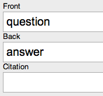
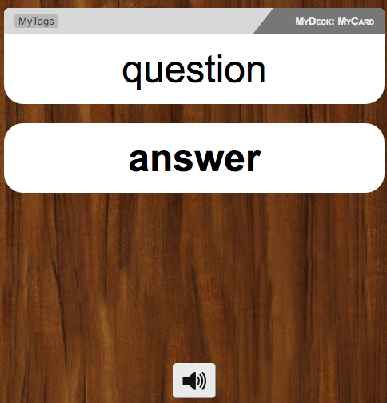
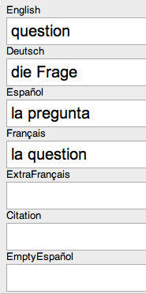
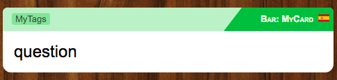
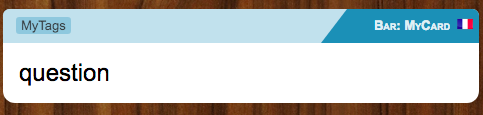
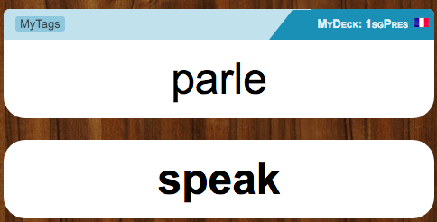
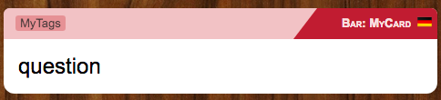
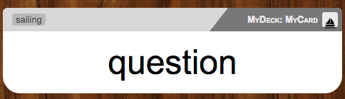

# anki-personal
Javascript &amp; CSS for my own personal Anki setup.

Why so much Javascript, instead of Python add-ons? Because I want the same
features available on desktop and iOS, but the latter doesn't support add-ons.

## Usage

1. `git clone` this project
2. `cp .env.example .env`
3. edit `.env` with your settings
4. `./update-anki.sh` to generate files and copy them to Anki's directory
5. Manually copy the generated `_global.css` file to each Note's style section, or use my [GlobalCSS Anki add-on](https://github.com/Arthaey/anki-global-css) to do it automatically.

## Screenshots

### Basic layout



### Per-language colors and flags

#### Spanish

#### French


#### German


### Per-topic icons
#### Sailing


## Prerequisites

- direnv
- sass
- eslint

Tested on OS X; probably works fine on Linux too.

### Anki card front template
```
<div class="card front">{{Front}}</div>

<script type="text/javascript">
  var ANKI_DATA = {
    deck: "{{Deck}}",
    note: "{{Type}}",
    card: "{{Card}}",
    tags: "{{Tags}}"
  };

  var script = document.createElement("script");
  script.type = "text/javascript";
  script.src = "_global.js";
  document.getElementsByTagName("head")[0].appendChild(script);
</script>
```

### Anki card back template
```
{{FrontSide}}

<!-- -------------------- --> <hr id="answer"> <!-- -------------------- -->

<div class="card back">{{Back}}</div>
```

## Tests

There are Jasmine tests for the more complicated Javascript bits.
Open `spec/SpecRunner.html` in a browser to run them and see their results.

Run the linter against the Javascript files via `eslint .`

## Icons

- Flag images are from [famfamfam](http://www.famfamfam.com/lab/icons/flags/).
- Topic icons are from [Icons8](https://icons8.com/).